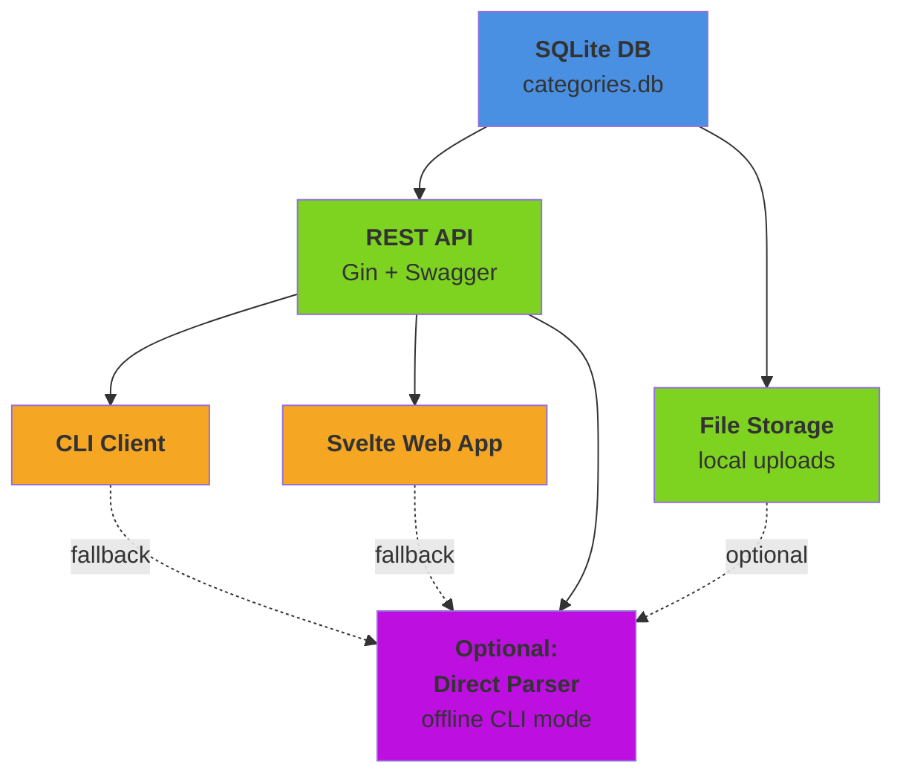
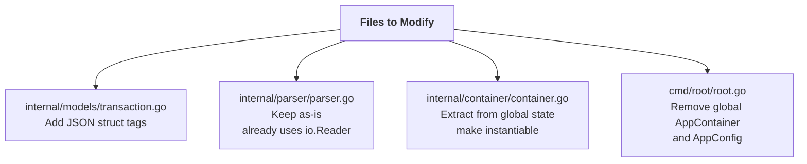
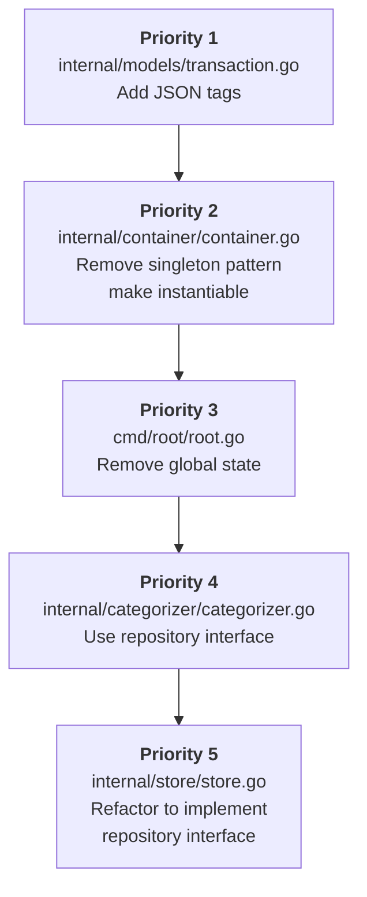
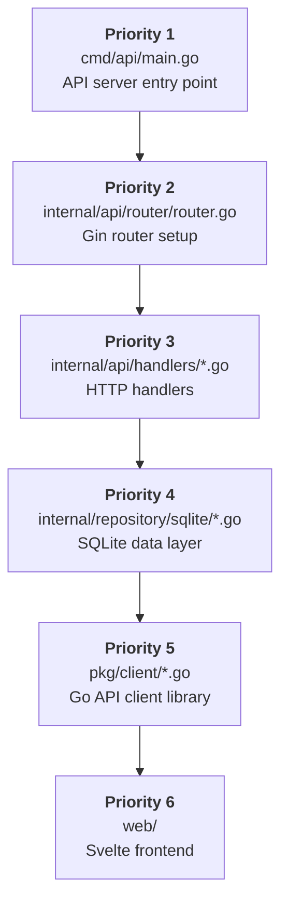
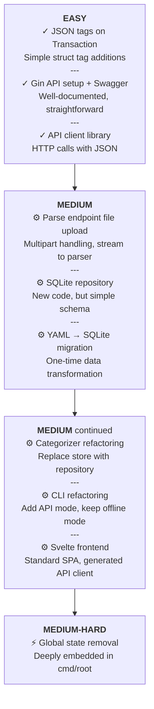

# Architecture Transformation Plan: camt-csv CLI to API + CLI + Web

## Overview

Transform the current monolithic CLI application into a three-tier architecture:

1. **Backend API** - Go REST API with Gin framework and Swagger docs
2. **CLI Client** - Thin Go CLI consuming the API
3. **Web Frontend** - Svelte SPA for interactive use

**Technology Stack:**

- API: Go + Gin + swaggo/swag (OpenAPI)
- Database: SQLite (embedded, single-user)
- Frontend: Svelte + TypeScript
- No authentication required (single-user)

---

## Target Architecture



---

## Phase 1: API Foundation

### 1.1 Create API Server Structure

**New files to create:**

```bash
cmd/api/main.go              # API server entry point
internal/api/
  router/router.go           # Gin router setup
  handlers/
    parse.go                 # /parse endpoints
    categorize.go            # /categorize endpoints
    categories.go            # /categories CRUD
    mappings.go              # /mappings CRUD
    health.go                # Health check
  middleware/
    logging.go               # Request logging
    recovery.go              # Panic recovery
    cors.go                  # CORS for Svelte
  dto/
    request.go               # Request DTOs
    response.go              # Response DTOs
```

### 1.2 Core API Endpoints

```bash
GET  /health                           # Health check
GET  /api/v1/parsers                   # List available parsers

POST /api/v1/parse/{format}            # Parse file to transactions
POST /api/v1/parse/{format}/validate   # Validate file format

POST /api/v1/categorize                # Categorize single transaction
POST /api/v1/categorize/batch          # Categorize multiple transactions

GET  /api/v1/categories                # List all categories
POST /api/v1/categories                # Create category
PUT  /api/v1/categories/{id}           # Update category
DELETE /api/v1/categories/{id}         # Delete category

GET  /api/v1/mappings/creditors        # List creditor mappings
POST /api/v1/mappings/creditors        # Add creditor mapping
DELETE /api/v1/mappings/creditors/{name}

GET  /api/v1/mappings/debtors          # List debtor mappings
POST /api/v1/mappings/debtors          # Add debtor mapping
DELETE /api/v1/mappings/debtors/{name}

POST /api/v1/export/csv                # Export transactions to CSV
GET  /swagger/*                        # Swagger UI
```

### 1.3 Refactor Existing Code

**Files to modify:**



**Key refactoring:**

```go
// BEFORE: Global state
var AppContainer *container.Container

// AFTER: Passed explicitly or created per-request
type APIServer struct {
    container *container.Container
    router    *gin.Engine
}
```

---

## Phase 2: SQLite Data Layer

### 2.1 Database Schema

**New file:** `internal/repository/sqlite/schema.sql`

```sql
CREATE TABLE IF NOT EXISTS categories (
    id INTEGER PRIMARY KEY AUTOINCREMENT,
    name TEXT UNIQUE NOT NULL,
    description TEXT,
    created_at DATETIME DEFAULT CURRENT_TIMESTAMP
);

CREATE TABLE IF NOT EXISTS category_keywords (
    id INTEGER PRIMARY KEY AUTOINCREMENT,
    category_id INTEGER REFERENCES categories(id) ON DELETE CASCADE,
    keyword TEXT NOT NULL,
    UNIQUE(category_id, keyword)
);

CREATE TABLE IF NOT EXISTS party_mappings (
    id INTEGER PRIMARY KEY AUTOINCREMENT,
    party_type TEXT NOT NULL CHECK (party_type IN ('creditor', 'debtor')),
    party_name TEXT NOT NULL,
    category_id INTEGER REFERENCES categories(id) ON DELETE SET NULL,
    source TEXT DEFAULT 'manual',
    created_at DATETIME DEFAULT CURRENT_TIMESTAMP,
    UNIQUE(party_type, party_name)
);

CREATE INDEX IF NOT EXISTS idx_mappings_lookup
    ON party_mappings(party_type, LOWER(party_name));
```

### 2.2 Repository Interface

**New files:**

```bash
internal/repository/
  repository.go              # Interface definitions
  sqlite/
    sqlite.go                # SQLite implementation
    category.go              # Category queries
    mapping.go               # Mapping queries
    migrate.go               # Schema migration
```

**Interface:**

```go
type CategoryRepository interface {
    LoadCategories(ctx context.Context) ([]models.CategoryConfig, error)
    SaveCategory(ctx context.Context, category *models.CategoryConfig) error
    DeleteCategory(ctx context.Context, id int64) error
    LoadCreditorMappings(ctx context.Context) (map[string]string, error)
    SaveCreditorMapping(ctx context.Context, partyName, category string) error
    LoadDebtorMappings(ctx context.Context) (map[string]string, error)
    SaveDebtorMapping(ctx context.Context, partyName, category string) error
}
```

### 2.3 Migration Tool

**New file:** `cmd/migrate/main.go`

Migrates existing YAML data to SQLite:

- Reads `database/categories.yaml` -> `categories` + `category_keywords` tables
- Reads `database/creditors.yaml` -> `party_mappings` (type='creditor')
- Reads `database/debitors.yaml` -> `party_mappings` (type='debtor')

---

## Phase 3: CLI Client Refactoring

### 3.1 API Client Library

**New files:**

```bash
pkg/client/
  client.go                  # HTTP client wrapper
  parse.go                   # Parse API calls
  categorize.go              # Categorize API calls
  categories.go              # Category management
  mappings.go                # Mapping management
```

### 3.2 CLI Command Changes

**Files to modify:**

```bash
cmd/camt/convert.go          # Use API client instead of direct parser
cmd/pdf/convert.go
cmd/revolut/convert.go
cmd/batch/convert.go
cmd/categorize/categorize.go
```

**New flags:**

```bash
--api-url     # API server URL (default: http://localhost:8080)
--offline     # Use direct parsing (no API, original behavior)
```

### 3.3 Backward Compatibility

Keep `--offline` mode that uses parsers directly (current behavior).
Default to API mode when server is reachable.

---

## Phase 4: Svelte Web Frontend

### 4.1 Project Structure

**New directory:** `web/`

```bash
web/
  src/
    lib/
      api/
        client.ts            # Generated from OpenAPI
      components/
        FileUpload.svelte    # Drag-drop upload
        TransactionTable.svelte
        CategoryManager.svelte
        MappingEditor.svelte
      stores/
        transactions.ts      # Svelte stores
        categories.ts
    routes/
      +page.svelte           # Home / Upload
      categories/+page.svelte
      mappings/+page.svelte
    app.html
  static/
  package.json
  svelte.config.js
  vite.config.ts
```

### 4.2 Core Features

1. **File Upload Page**

   - Drag-drop zone for file upload
   - Format auto-detection
   - Real-time parsing progress
   - Transaction table display
   - CSV export button

2. **Category Management**

   - List/create/edit/delete categories
   - Keyword management per category

3. **Mapping Management**
   - View creditor/debtor mappings
   - Search/filter mappings
   - Manual mapping creation
   - Delete learned mappings

---

## Implementation Order

### Step 1: Add JSON tags to Transaction model

- File: `internal/models/transaction.go`
- Add `json:"field_name"` tags to all fields

### Step 2: Create API server skeleton

- Create `cmd/api/main.go`
- Create `internal/api/router/router.go`
- Create health endpoint
- Add Swagger setup with swaggo/swag

### Step 3: Implement parse handlers

- Create `internal/api/handlers/parse.go`
- Handle multipart file upload
- Return JSON transactions
- Wire existing parsers

### Step 4: Implement SQLite repository

- Create schema and migration
- Implement CategoryRepository interface
- Create migration tool for YAML -> SQLite

### Step 5: Implement category/mapping handlers

- Create CRUD endpoints
- Wire to SQLite repository

### Step 6: Refactor categorizer for SQLite

- Update `internal/categorizer/categorizer.go`
- Use repository instead of direct YAML access
- Keep auto-learning functionality

### Step 7: Create API client library

- Create `pkg/client/`
- Generate from OpenAPI or hand-write

### Step 8: Refactor CLI commands

- Add `--api-url` and `--offline` flags
- Use API client by default
- Fall back to direct parsing in offline mode

### Step 9: Build Svelte frontend

- Set up SvelteKit project
- Generate API client from OpenAPI spec
- Implement file upload page
- Implement category/mapping management

### Step 10: Docker packaging

- Dockerfile for API server
- Docker Compose for full stack
- Optional: single binary with embedded frontend

---

## Critical Files to Modify



## New Files to Create



---

## Complexity Assessment



---

## Risks & Mitigations

1. **Risk**: Breaking existing CLI behavior

   - **Mitigation**: `--offline` flag preserves original behavior

2. **Risk**: Data loss during YAML -> SQLite migration

   - **Mitigation**: Migration tool with dry-run mode, backup before migration

3. **Risk**: Auto-learning not working with SQLite

   - **Mitigation**: Thorough testing of categorizer with new repository

4. **Risk**: API and frontend getting out of sync
   - **Mitigation**: Generate Svelte API client from OpenAPI spec

---

## Success Criteria

- [ ] API server runs and serves Swagger UI
- [ ] File upload and parsing works via API
- [ ] Categories and mappings stored in SQLite
- [ ] Auto-learning saves to SQLite
- [ ] CLI works in both API and offline modes
- [ ] Svelte frontend can upload, parse, and export
- [ ] All existing tests pass
- [ ] New integration tests for API endpoints
